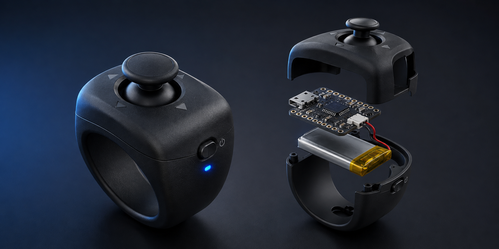

# BLE Video Controller Ring


A compact Bluetooth video controller prototype built with a Seeed Studio XIAO nRF52840 Sense and a five-direction navigation joystick. The controller appears as a Bluetooth HID device and sends playback, seek, and playback-speed commands to the connected computer.



> **Concept visualization:** The image above is AI-generated and represents the planned ring-style enclosure. The current working hardware is a breadboard prototype.

## Current status

- Working breadboard prototype
- Bluetooth pairing and automatic advertising
- Play/pause through the standard HID consumer media command
- Forward and backward seeking through arrow-key commands
- Playback-speed shortcuts for compatible video players
- Tested on YouTube in a desktop browser
- Battery-powered version and compact enclosure are planned

## Controls

| Joystick action | Command | Notes |
| --- | --- | --- |
| Press up | Increase playback speed (`>`) | Player and keyboard-layout dependent |
| Press down | Decrease playback speed (`<`) | Player and keyboard-layout dependent |
| Press left | Left Arrow | Seeks backward on compatible players |
| Press right | Right Arrow | Seeks forward on compatible players |
| Press center | Play/Pause media command | Uses standard Bluetooth HID consumer control |

The video player may need to be focused once before the left and right arrow commands work. Playback-speed shortcuts are not standardized and can behave differently across websites and keyboard layouts.

## Hardware

- Seeed Studio XIAO nRF52840 Sense
- Five-direction navigation joystick module
- Breadboard and jumper wires
- USB-C data cable
- Planned: 3.7 V 1S 350 mAh LiPo battery
- Planned: slide power switch
- Planned: compact perfboard/PCB and ring enclosure

## Wiring

The joystick in the current prototype is mounted 180 degrees from its printed orientation, so the physical directions are corrected in firmware.

| Joystick signal | XIAO pin | Physical action |
| --- | --- | --- |
| `COM` | `GND` | Common ground |
| `UP` | `D0` | Physical down |
| `DWN` | `D1` | Physical up |
| `LFT` | `D2` | Physical right |
| `RHT` | `D3` | Physical left |
| `MID` | `D4` | Center press |
| `SET` | Not connected | Unused |
| `RST` | Not connected | Unused |

The inputs use the microcontroller's internal pull-up resistors. A pressed direction connects its GPIO pin to ground, so a press is read as `LOW`.

## Arduino IDE setup

1. Open **File → Preferences** in Arduino IDE.
2. Add this URL to **Additional Boards Manager URLs**:

   ```text
   https://files.seeedstudio.com/arduino/package_seeeduino_boards_index.json
   ```

3. Open **Tools → Board → Boards Manager**.
4. Search for and install **Seeed nRF52 Boards**.
5. Select **Seeed XIAO nRF52840 Sense** and the correct serial port.
6. Open [`firmware/video_controller/video_controller.ino`](firmware/video_controller/video_controller.ino).
7. Upload the sketch.

If Arduino reports that `Adafruit_TinyUSB.h` is missing, install **Adafruit TinyUSB Library** from the Arduino Library Manager.

## Publish to GitHub

GitHub automatically displays this `README.md` below the repository file list. The concept image is stored at `docs/concept-render.png` and is displayed through the relative image path used near the top of this README.

For the first upload on Windows:

1. Create an empty repository named `ble-video-controller-ring` on GitHub.
2. Do not add a README, `.gitignore`, or license on the GitHub creation screen.
3. Run `PUBLISH_TO_GITHUB.bat` from the project folder.
4. Paste the repository URL when requested, for example:

   ```text
   https://github.com/USERNAME/ble-video-controller-ring.git
   ```

5. Complete the GitHub sign-in window if Git asks for authentication.

## Pairing

1. Upload the firmware while the board is connected through USB-C.
2. Open the computer's Bluetooth settings.
3. Add a new Bluetooth device.
4. Select **Video Kumanda**.
5. Open a video, focus the player, and test the joystick.

If a firmware update causes connection problems, remove **Video Kumanda** from the paired-device list and pair it again.

## How it works

The joystick is a group of momentary switches rather than an analog joystick. Each direction is connected to a separate GPIO configured with `INPUT_PULLUP`. The firmware detects the transition from released to pressed, applies a short software debounce interval, and sends the mapped command through Bluetooth Low Energy HID.

## Known limitations

- Playback-speed control is application and keyboard-layout dependent.
- Seek behavior varies between video players.
- The current firmware is optimized for desktop browser playback.
- Battery runtime has not yet been measured.
- The current hardware is still on a breadboard.

## Roadmap

- [x] Read all five joystick actions
- [x] Connect as a BLE HID device
- [x] Control desktop YouTube playback
- [ ] Integrate the 3.7 V LiPo battery and power switch
- [ ] Measure average current and battery runtime
- [ ] Add a low-power sleep mode
- [ ] Move from breadboard to perfboard or a custom PCB
- [ ] Design and print the ring-style enclosure
- [ ] Test compatibility with additional browsers and video platforms

## Safety note

The XIAO nRF52840 Sense supports a single-cell 3.7 V LiPo battery through its battery pads. Battery polarity must be verified before connection. Do not connect the LiPo battery directly to the `3V3` or `5V` pin.

## Author

Developed by **Emir Toktay** as an embedded systems and Bluetooth HID prototype.
